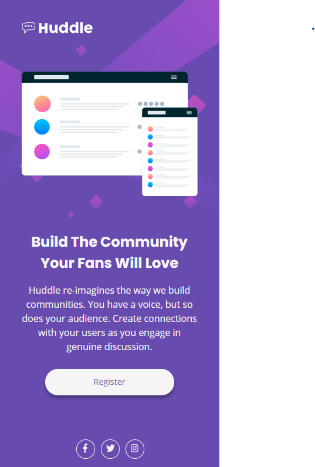

# Huddle landing page solution with HTML and CSS using Flexbox


## Hi! 👋

Thank you for checking this solution! If you don't know what I'm talking about, this is a solution to the [Huddle landing page with a single introductory section](https://www.frontendmentor.io/challenges/huddle-landing-page-with-a-single-introductory-section-B_2Wvxgi0). This is actually my first Front-End Mentor Challenge, and also my first approachment to CSS by my own.

## Table of contents

- [Overview](#overview)
  - [The challenge](#the-challenge)
  - [Screenshot](#screenshot)
  - [Links](#links)
- [My process](#my-process)
  - [Built with](#built-with)
  - [What I learned](#what-i-learned)
  - [Continued development](#continued-development)
  - [Useful resources](#useful-resources)
- [Author](#author)
- [Acknowledgments](#acknowledgments)

## Overview

### The challenge

- Build out the project to the designs provided.

### Screenshot

#### Desktop:

#### Mobile:


### Links

Here you can try the live site or give me a comment!
- [Live Site](https://thenutscout.github.io/HuddlePage/)
- [Solution](https://www.frontendmentor.io/solutions/huddle-landing-page-solution-with-html-and-css-using-flexbox-8xxgVxXin)

## My process

### Built with

- Semantic HTML5 markup
- CSS custom properties
- Flexbox
- Mobile-first workflow
- [Normalize](https://necolas.github.io/normalize.css/)
- Google Fonts for:
  - [Open Sans](https://fonts.google.com/specimen/Open+Sans?preview.text_type=custom)
  - [Poppins](https://fonts.google.com/specimen/Poppins?preview.text_type=custom)
- Fontawesome for icons:
  - [Facebook](https://fontawesome.com/icons/facebook-f?style=brands)
  - [Twitter](https://fontawesome.com/icons/twitter?style=brands)
  - [Instagram](https://fontawesome.com/icons/instagram?style=brands)


### What I learned

As I said before, this is my first approachment to CSS by my own so I had to think out of the box that I used to have and re-learn some concepts that I learned in school. One of the things that I did and I really liked was the use of utility clases for CSS and HTML like the `circle` class where I used this class to draw a circle around a svg.

```css
.circle{
  border: 1px;
  border-style: solid;
  border-radius: 1em;
  border-color: whitesmoke;
  width: 1.88em;
  margin: 0.3em;
}
```

Other thing that I really liked was the use of @media queries to get the size of the page and know how to work with it, like this one that I used for the `page-header` class:

```css
@media screen and (min-width: 968px){
  .page-header{
    background-image: url('../images/bg-desktop.svg');
    padding: 2.5em 0 2.5em 3.3em;
    width: 160vh;
    height: 90vh;
  }
}
```

Also I used flexbox for almost everything except the logo and social images and that's something that I liked because how flexible (no pun intended) it is to move the boxes all around the page.

### Continued development

As I showed in the [screenshot](#screenshot) the page design works fine... for the width given by the style-guide. If the width gets any bigger or smaller the shape of the text (and some parts of the page overall) changes, and that's something that I didn't liked. Maybe it's because I prefered to use `em` instead of percentages for the sizing of text and padding for the desktop version, so I want to balance this more in future challenges.

Also it's my first time working with svg's, and I think that I managed it really fine for the backgrounds. But I didn't finished to learn how they work really well so I used them as images for the styling and (as I read) I think that's wrong somehow. It could work for this situation but I don't think it would work for other ones (correct me if I'm wrong!). So I want to learn more in svg and learn how to use it properly in other challenges.  

At the end I think the page got decent, but I think I'll try it again on another time. Maybe when I learn how to get over these flags, or maybe just update this solution. I'll see what's best in the future.

### Useful resources

- [Mozilla developer](https://developer.mozilla.org/en-US/docs/Web/CSS) - This helped me searching in some css doubts that I had while working on this project. It's very complete (even helping me in other coding stuff like JS) so I recommend to check it.
- [StackOverflow thread](https://stackoverflow.com/questions/22252472/how-to-change-the-color-of-an-svg-element) - This helped me to learn how to change the color of a svg. It has a lot of solutions so if a solution doesn't convince you, you can try the next one!
- [Clickpen filter generator](https://codepen.io/sosuke/pen/Pjoqqp) - The filter generator that helps you how to change colors! It's the technique that I used in this challenge.
- [Dev George's tutorial](https://www.youtube.com/watch?v=7T3POT0oQvc) - Tutorial that I based (and made me knew about Frontend Mentor) all my code from the mobile design (only in spanish).

## Author

By the moment my only contact that I give is my Frontend Mentor account, here you can know a little about me and check the other solutions that I will upload:

- Frontend Mentor - [@thenutscout](https://www.frontendmentor.io/profile/thenutscout)

## Acknowledgments

And here we are at the end! I really liked this challenge so I want to first thank Frontend Mentor to create this challenge. Also I want to thank Algoritmia Club GDA (Dev George) which you can check their page [here](https://www.algoritmia-gda.club) (only in spanish) and my friends Pedro and Alex, because if it wasn't by them I wouldn't know about the existing of this page or inspire me to try this type of challenges. At the end but not less important I want to thank **YOU** for taking the time to check this solution and read this loooooooooooooong README. I hope you like what you see and wish you a nice coding!
